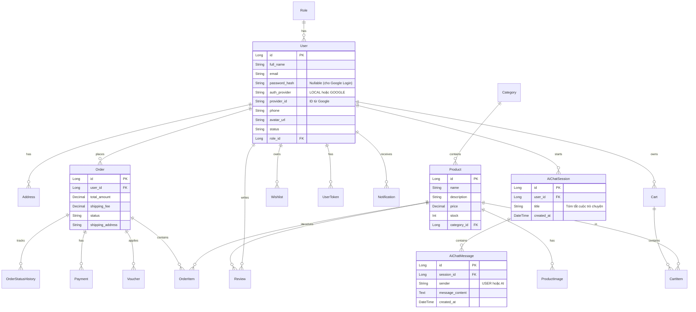

# Database Schema - ThunderFood

Dựa trên các Entity từ Backend (Spring Boot) và yêu cầu bổ sung tính năng **Đăng nhập Google** cùng **Trợ lý AI Chatbot**, dưới đây là lược đồ cơ sở dữ liệu tổng quan cho hệ thống.

## Lược đồ quan hệ (ERD)

## Các thay đổi quan trọng vừa được cập nhật
1. **Bảng `users` (Entity `User.java`):**
   - Đã chuyển `password_hash` thành có thể `null` (nullable).
   - Thêm cột `auth_provider` với giá trị mặc định là `LOCAL` (hỗ trợ `GOOGLE`).
   - Thêm cột `provider_id` để lưu trữ Google ID nhằm liên kết tài khoản an toàn hơn.
2. **Bảng AI Chatbot (Đề xuất thêm cho Backend sau này):**
   - `ai_chat_sessions`: Lưu trữ các phiên chat của người dùng với Trợ lý AI, giúp họ có thể xem lại lịch sử tư vấn.
   - `ai_chat_messages`: Lưu chi tiết các tin nhắn trong từng phiên (phân biệt người gửi là `USER` hay `AI`).

## Các bảng khác hiện có trong Backend
- `Address`, `Banner`, `Category`, `Notification`, `Role`, `SystemSetting`, `UserToken`, `Voucher`: Các bảng cấu hình và dữ liệu phụ trợ.
- `Cart`, `CartItem`: Quản lý giỏ hàng tạm thời.
- `Payment`, `OrderStatusHistory`: Quản lý lịch sử giao dịch và theo dõi trạng thái vận chuyển của đơn hàng.
- `ProductImage`, `Wishlist`: Hỗ trợ hiển thị UI và trải nghiệm mua sắm.
